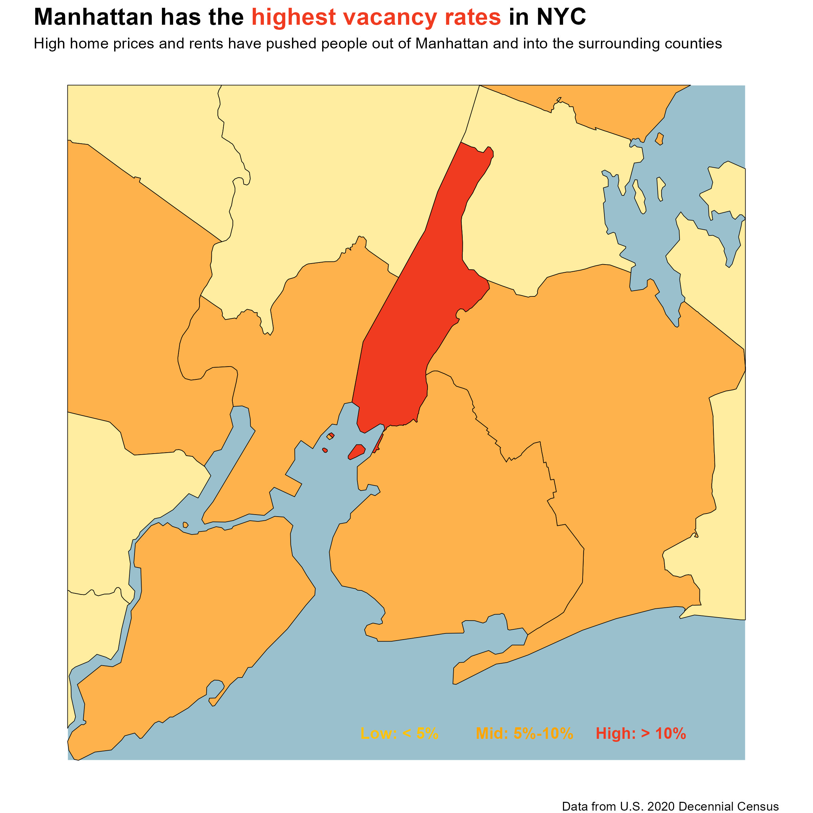
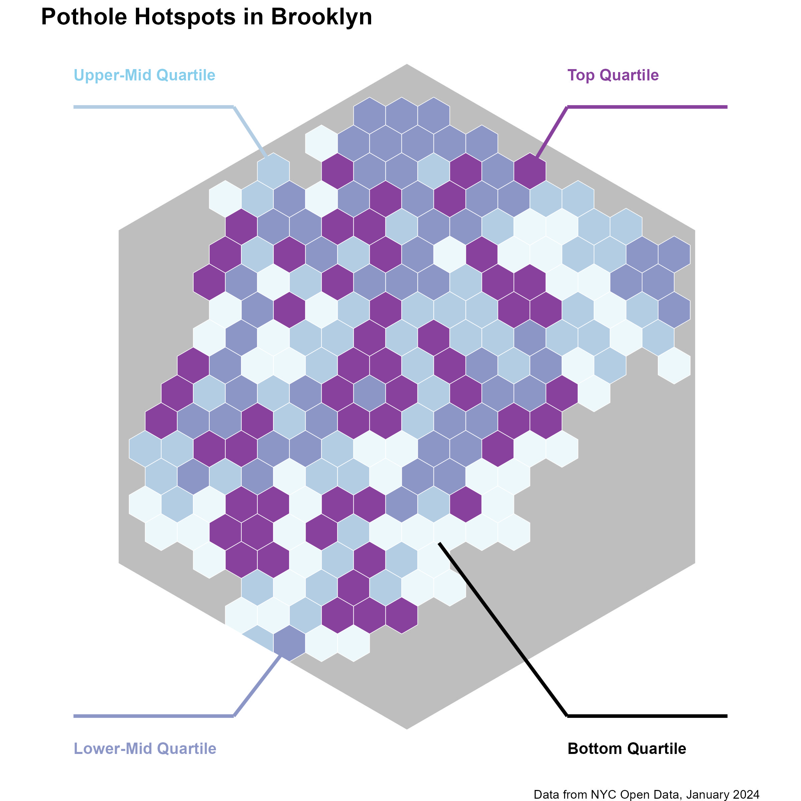
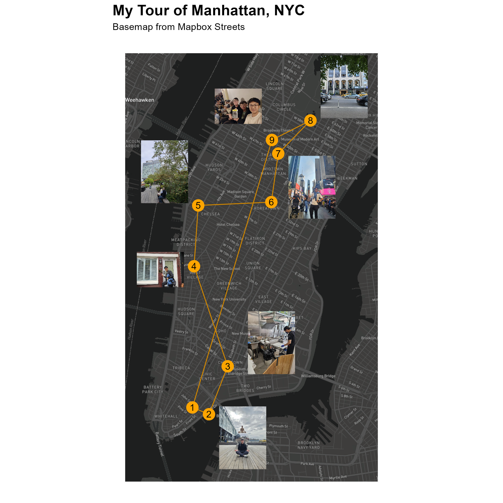
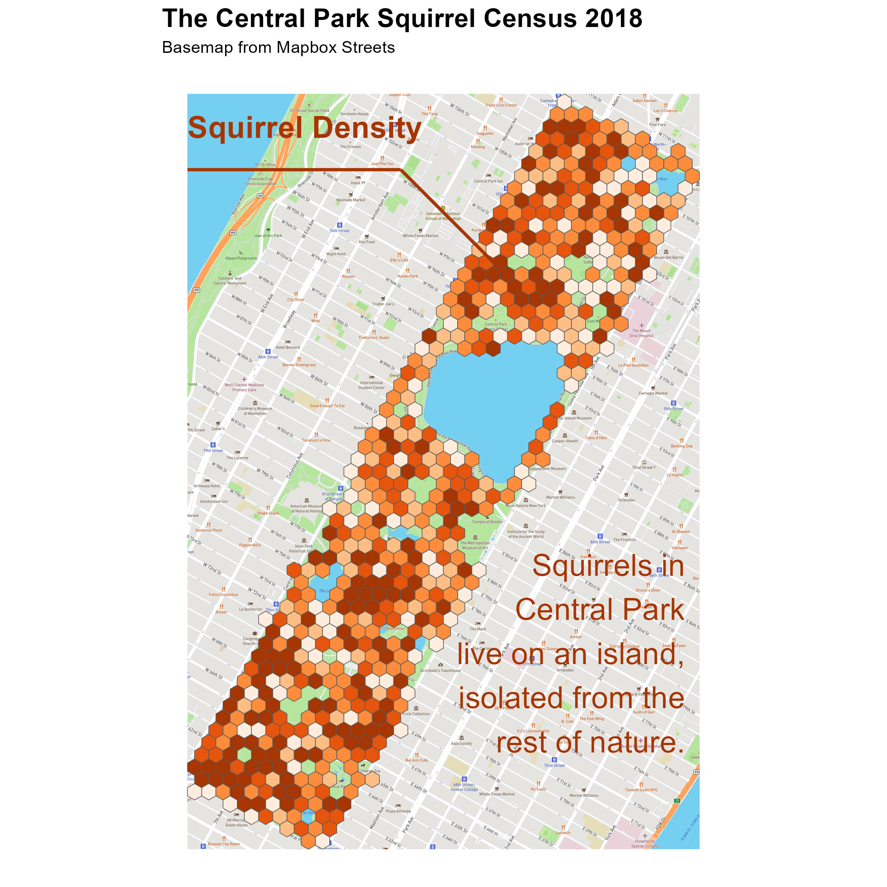
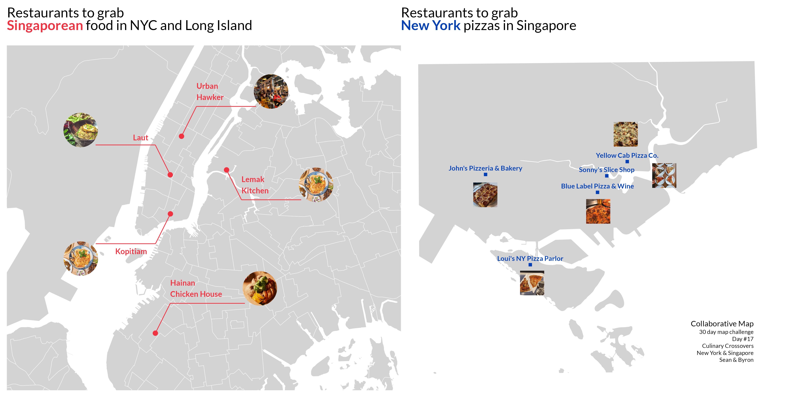
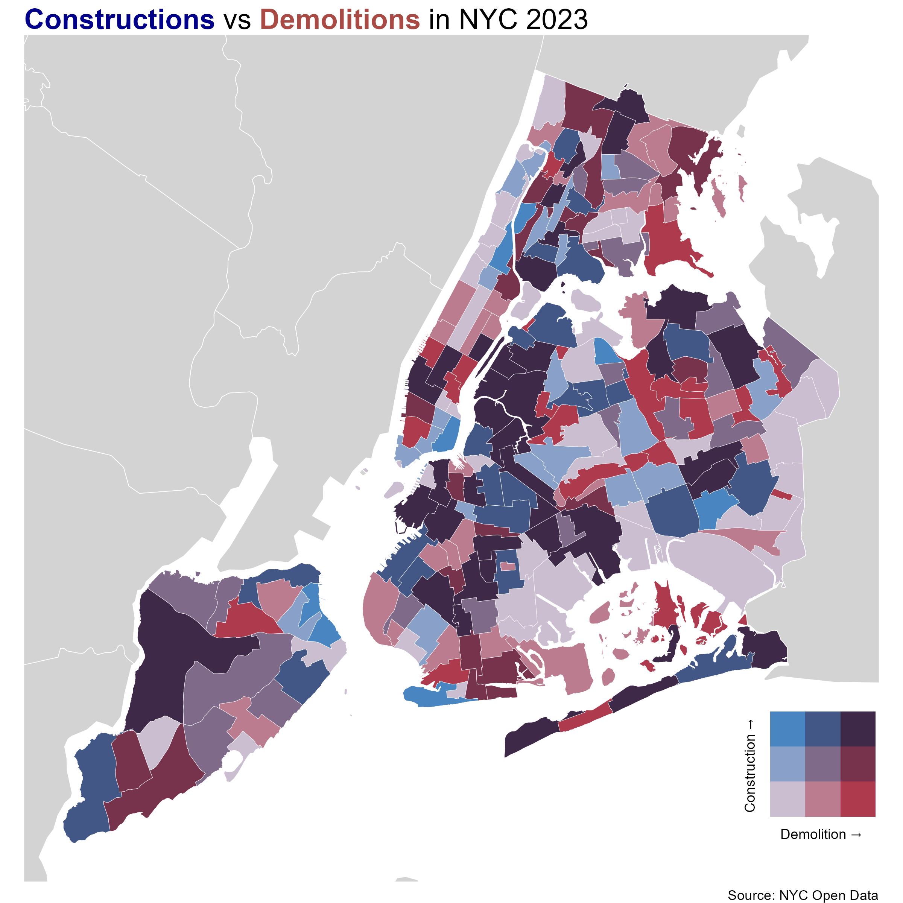
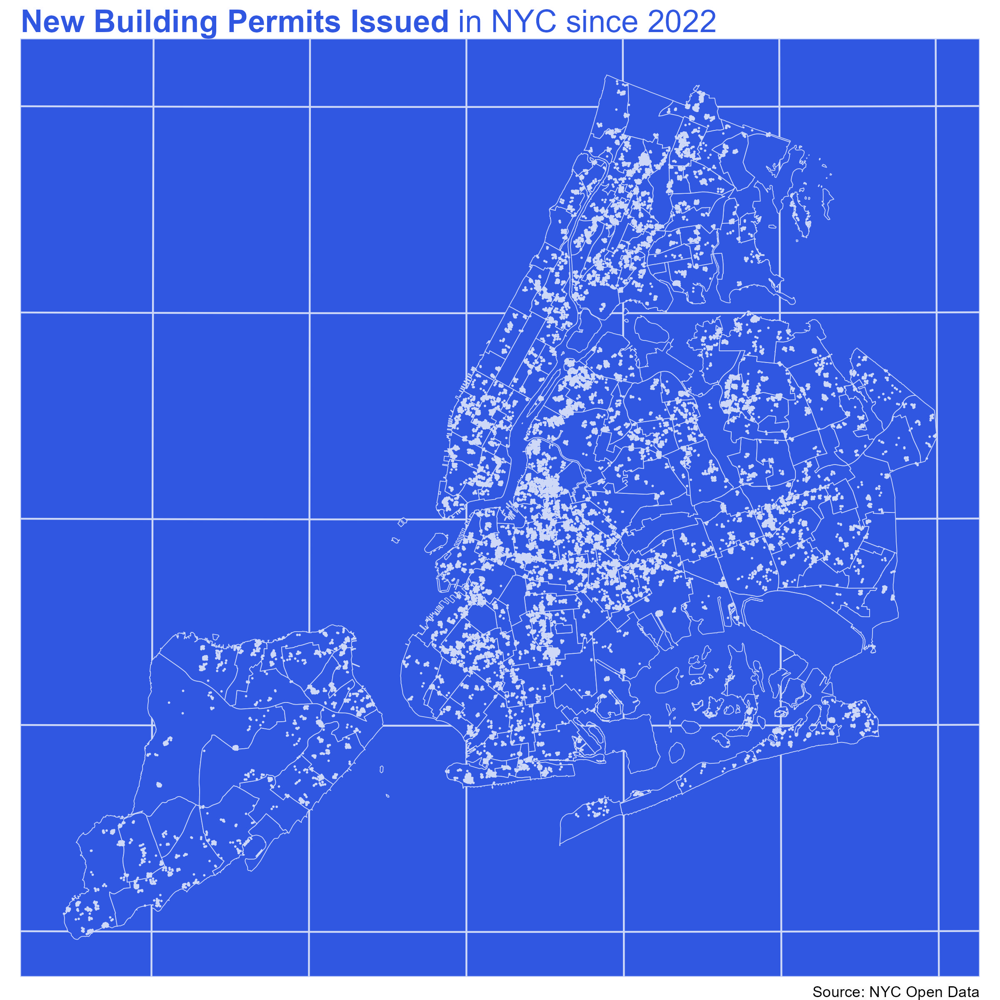
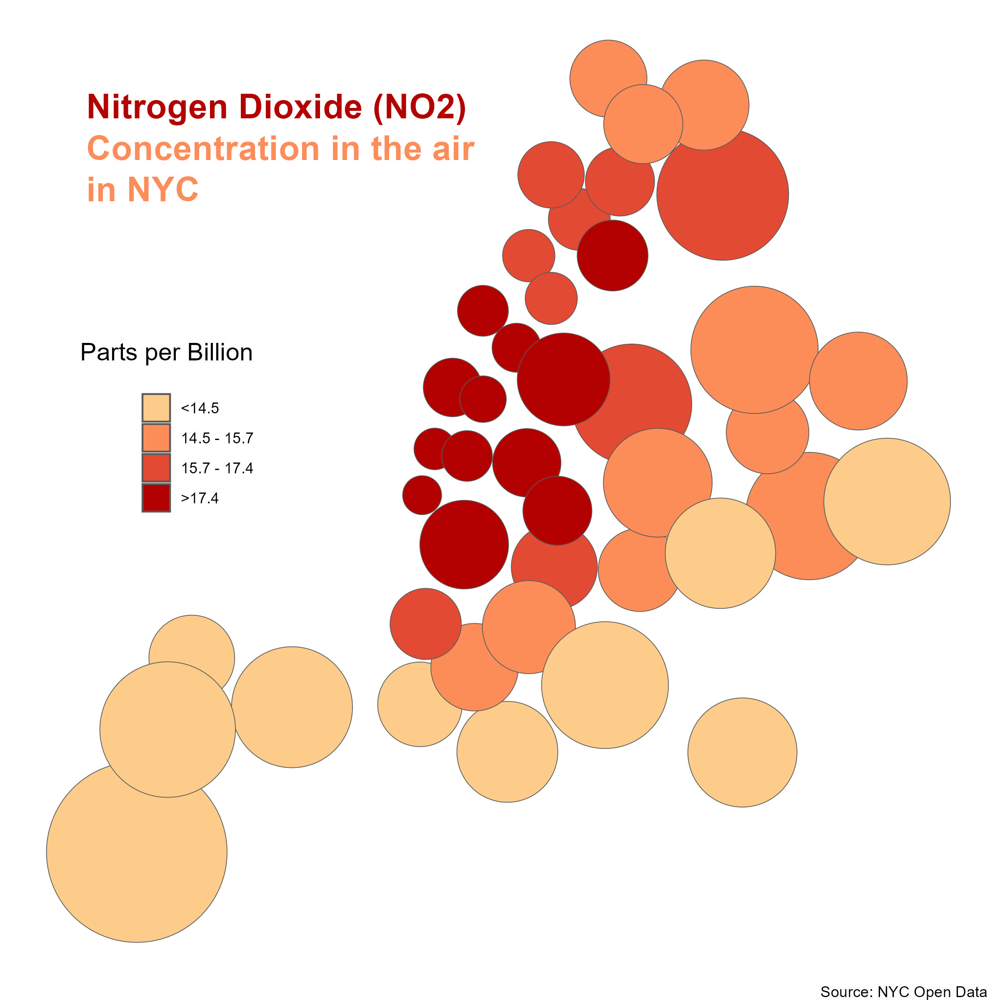
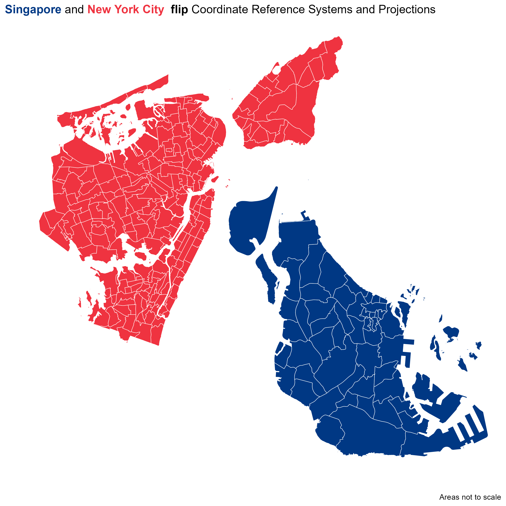
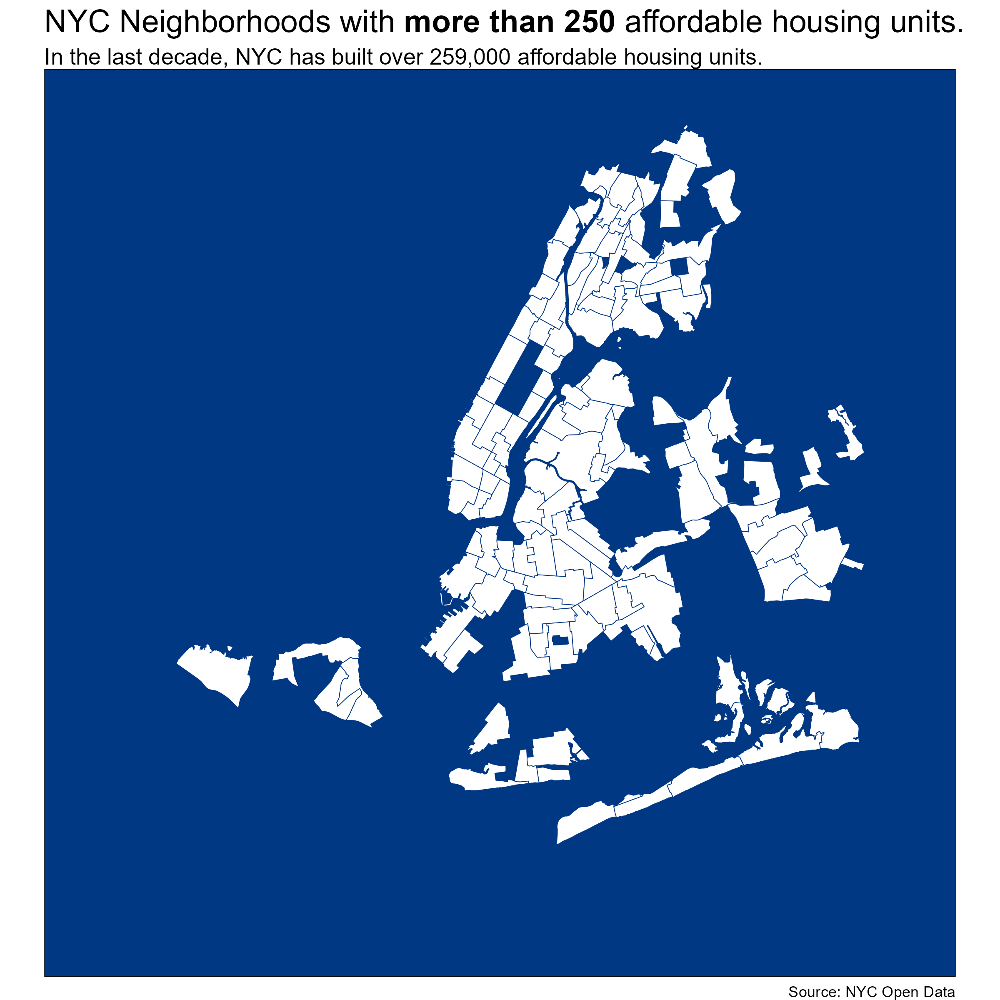

```{r setup, include=FALSE}
knitr::opts_chunk$set(echo = FALSE,
                      message = FALSE)
```

## Day 3: [Polygons](https://github.com/Theta1112/my-30-day-maps/blob/main/scripts/day-3.R)

On my first day, I was not really sure what my theme was going to be. I just wanted to get started so I found some data on vacancy rates from the 2020 Decennial Census. I focused on using colour to highlight my key message: that Manhattan had high home vacancy rates. I initially used the tract-level data but I found that it took away form my main message and made the story more difficult to share. Thus, I focused on county level data instead.

I also wanted to try showing the surrounding area in NJ and provide a background for the waterways.

I tried to label the data using highlighted annotations that colour coded the zones, which was a pattern in my earlier maps. 

Overall, I'm not particularly proud of this one but it was a start. 

 

## Day 4: [Hexagons](https://github.com/Theta1112/my-30-day-maps/blob/main/scripts/day-4.R)

I love hexagons (they are the bestagons) so I had to do a map for this day. I noticed that Brooklyn was relatively round-ish so I figured it could fit into a big hexagon. Thus, I wanted to try out creating a hexagon background that could "crop" map data onto, inspired by the circle cropped maps seen in class.

I was initially aiming for a bivariate map as I wanted to use the angular line labels that I had practiced in the bivariate map excercise. However, I couldn't find any data that seemed to make sense with pothole reports. So, I just kept it simple with a basic categorical colour scheme. Making it a hybrid raster / chloropleth plot. 

Overall, I think the colour choices could have been better but I enjoyed exploring the hexagon crop and fitting as many hexagons as I could onto a single map. 

 

## Day 5: [Journey](https://github.com/Theta1112/my-30-day-maps/blob/main/scripts/day-5.R)

At this point, I realised that my theme should probably just be NYC. There was an abundance of data from the NYC Open Data site and it would also help me reduce the effort in finding background shapes. 

For this map, I initially just wanted to plot out my recent trip to NYC. I started out with just points and a polyline but I found that particularly ugly. A polygon map did not show the interesting streetscape and landmarks that I had visited. So I explored trying out to work with basemaps in R ad managed to fit my journey onto a dark Mapbox basemap. (once again using colour for contrast)

I initially added annotations to describe the location I was at for each point. However, I found this map looking a bit dull for something that was supposed to be fun. Thus, I substituted text annotations of each location for pictures from the trip instead. It would let me practice with inserting images onto maps (which I had not tried prior to this) and would make the map more fun. I relied on the principle of proximity of the images to the points in order to link them up.  

Overall, this map was not particularly skillful. But it was a fun excercise and I hoped that I managed to match the theming and energy of the trip with this map. 



## Day 6: [Raster](https://github.com/Theta1112/my-30-day-maps/blob/main/scripts/day-6.R)

Honestly, I was really busy around this time and did not have sufficient time to make a map. I was initially planning to use the squirrel census for day 1 - points, but I ran out of time to make it. Further, because there were just too many points, I figured a point based map wouldn't look too good either. 

For this map, I had to create a polygon representing central park by hand so that I could nicely crop the rasterized hexagons. Beyond that, I just combined what I learned from the prior two days (hexagon rasterization and basemaps) to create this map. I was trying to go for a "squirrel-coloured" raster but I don't quite think I succeeded with that. 

Nonetheless, I think people were more distracted by the fact that Central Park had a Squirrel Census than with the particular techique of the map. 



## Day 17: [Collaboration](https://github.com/Theta1112/Day-19-Collaboration/blob/main/17-byron.Rmd)

When Byron and I talked about doing a collaboration, I figured it would make the map making easier. The formatting took up more effort than I expected in the end. 

I wanted to play with out respective themes: NYC and Singapore (SG). On Byron's suggestion, we did SG food in NYC and NYC food (pizza) in SG. We also swapped color themes to highlight this mixing of cultures. I used red, which is the national colour of Singapore, while Byron used an NYC dark blue. Technique-wise, 

Overall, it was another light-hearted map. But I think the collaboration between cultures and map themes made the map interesting. 





## Day 21: [Conflict](https://github.com/Theta1112/my-30-day-maps/blob/main/scripts/day-21.R)

A conflict that I really liked was the tension between demolition and construction. On the outset, these two ideas appear in opposition: one is about building new housing and another is about tearing them down. However, I found that they tend to go hand-in-hand. You must tear down the old to make room for the new. 

This gave me the chance to take another stab at the bivariate map looked at in class. I didn't do the leading line and annotations partially because I felt that I had already overused this technique and partially because I found the map already quite cluttered. I thought blue for construction and red for demolition was a natural choice and made it quite intuitive what the map was showing. 

Overall, I think its one of my better maps because it shows an interesting relationship between construction and demolition in NYC. 



## Day 22: [Two Colours](https://github.com/Theta1112/my-30-day-maps/blob/main/scripts/day-22.R)

I initially wanted to do my construction and demolition map again but with coloured points. But I realised that the map didn't quite make sense without at least a background outline of NYC. However, this outline would then make the map 3 colours which is technically a violation. 

I tried playing around with modifying the background colour when I realised that the axis lines did not change colour with the background. This made the map look almost like a blueprint which inspired me to make the final blueprint-themed map. Like real blueprints, the map only uses two colours but manages to convey the relative density of the points. (The density was achieved by using st_jitter)

The restriction forced me to show one very simple message (the density of building permits issued) and inadvertantly allowed me to create a nice theming with it too. 

Overall, I really liked how this map turned out and found it to be one of my better maps.



## Day 24: [Circles](https://github.com/Theta1112/my-30-day-maps/blob/main/scripts/day-24.R)

For this map theme, I had a major problem: How could one create a circle-only map that somehow still looked like NYC? My solution was to use the NYC neighborhood polygons and create circles centered at the centroids each polygon. Then, I made the circles proportional to the area of the initial neighborhood polygons. 

The colour of the circles then defined the concentration of air pollution in each neighborhood. This was not particularly intentional but the final map looked somewhat liked air bubbles rising up, which themed nicely with the topic of air pollution being discussed. Finally, due to the empty space in the top left, I tried to insert the title as an annotation instead.

Overall, a nice restriction that gave rise to an un-intentionally styled map. 



## Day 26: [Projections](https://github.com/Theta1112/my-30-day-maps/blob/main/scripts/day-26.R)

For this challenge, I wanted to try projecting NYC out with a weird distorting projection. However, these distorting projections tend to work better with larger areas and NYC is quite small. Thus, I just experimented with what happened to the shape of the city when I used another cities (Singapore's) CRS on it. Turns out it just flipped it upside down. 

This inspired me to overlay the two plots together using patchwork. (Which I learned from the improved story assignment earlier in the month)

Another fun map that wasn't particularly technical. My only regret is that the final colour scheme looks strangely like the French flag due to the ordering of the colours. 



## Day 30: [Final](https://github.com/Theta1112/my-30-day-maps/blob/main/scripts/day-30.R)

My maps are usually very playful, so I wanted to make my last map something a bit more serious. 
This map looks at housing in NYC, which I have explored in a few other maps this month. 

The big idea of this map is where there isn't affordable housing (i.e. what's missing). I wanted my map to really focus in on that idea and so I removed the areas I wanted to highlight from the map. What remains is a somewhat recognizable shape but missing some large portions of the city. The aim of this design is to force the audience to think about the areas of the city that are not shown on this map. 

Appropriately, I'm the most proud of my final map. It's a little different from my other maps and its not particularly technical or aesthetic. However, I really liked how I tied together the mapping technique and my main message.


